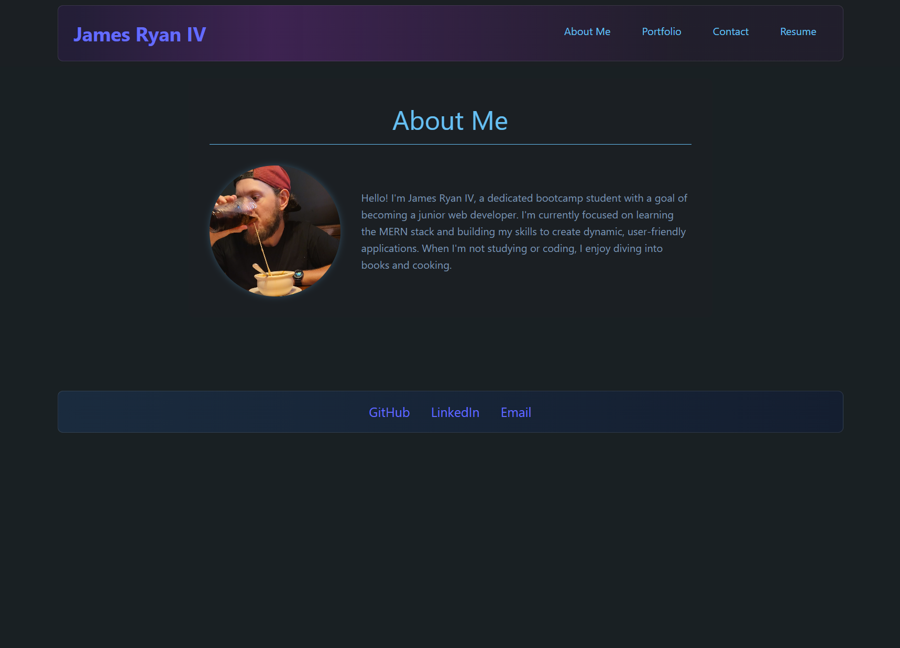

# React Portfolio

## Description
This is my personal portfolio website built with React. It showcases my projects, skills, and provides information about me as a web developer. The site includes sections for About Me, Portfolio, Contact, and Resume.

## Table of Contents
- [Description](#description)
- [Usage](#usage)
- [Installation](#installation)
- [Credits](#credits)
- [License](#license)

## Usage
This site has been deployed on Netlify.
- **Repository**: [REACT-Portfolio- GitHub](https://github.com/KitKatKernel/REACT-Portfolio-)
- **Netlify Deployment**: [James Ryan IV Portfolio](https://jamesryan.netlify.app)

## Installation
To run this project locally:
1. Clone the repository.
2. Navigate to the project directory.
3. Install the dependencies using `npm install`.
4. Start the development server using `npm run dev`.

## Usage
1. After starting the development server, open your browser and go to `http://localhost:3000`.
2. Navigate through the different sections using the menu.
3. In the Portfolio section, you can view my projects and their details.
4. Use the Contact form to send me a message.
5. The Resume section provides a downloadable version of my resume and lists my proficiencies.

## Credits
A heartfelt thank you to my bootcamp instructors, peers, and the web development community for their continuous guidance and support. Special thanks to:
- [React Documentation](https://reactjs.org/docs/getting-started.html) for comprehensive resources on React.
- [Vite Documentation](https://vitejs.dev/guide/) for information on Vite features and configuration.
- [Netlify Documentation](https://docs.netlify.com/) for deployment guidance.
- [MDN Web Docs](https://developer.mozilla.org/en-US/) for their extensive web development resources.
- [Stack Overflow](https://stackoverflow.com/) for providing solutions to coding challenges.

## License
MIT License 

Permission is hereby granted, free of charge, to any person obtaining a copy of this software and associated documentation files (the "Software"), to deal in the Software without restriction, including without limitation the rights to use, copy, modify, merge, publish, distribute, sublicense, and/or sell copies of the Software, and to permit persons to whom the Software is furnished to do so, subject to the following conditions:

The above copyright notice and this permission notice shall be included in all copies or substantial portions of the Software.

THE SOFTWARE IS PROVIDED "AS IS", WITHOUT WARRANTY OF ANY KIND, EXPRESS OR IMPLIED, INCLUDING BUT NOT LIMITED TO THE WARRANTIES OF MERCHANTABILITY, FITNESS FOR A PARTICULAR PURPOSE AND NONINFRINGEMENT. IN NO EVENT SHALL THE AUTHORS OR COPYRIGHT HOLDERS BE LIABLE FOR ANY CLAIM, DAMAGES OR OTHER LIABILITY, WHETHER IN AN ACTION OF CONTRACT, TORT OR OTHERWISE, ARISING FROM, OUT OF OR IN CONNECTION WITH THE SOFTWARE OR THE USE OR OTHER DEALINGS IN THE SOFTWARE.